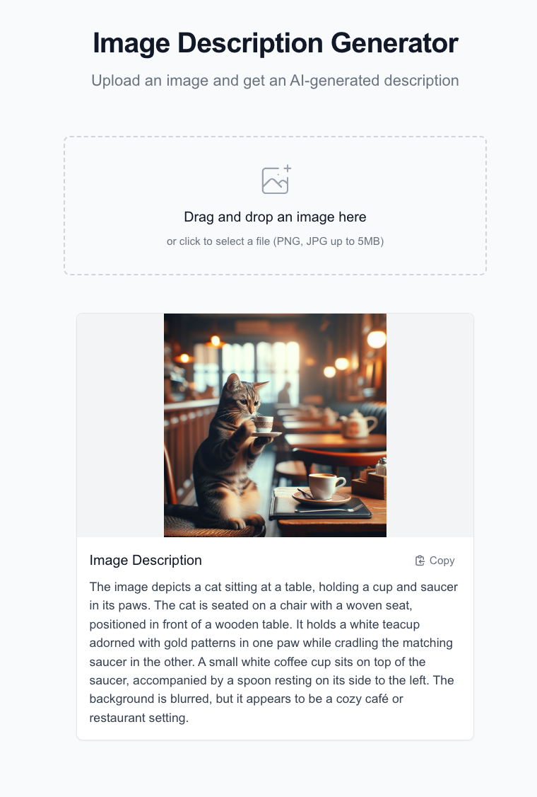
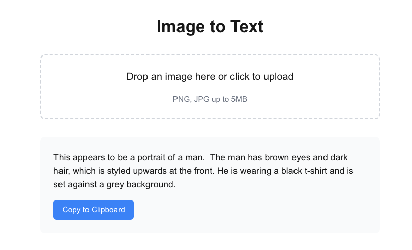
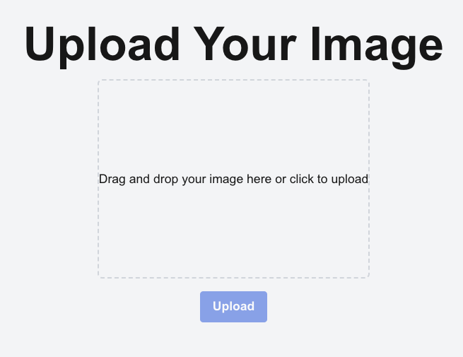

# Code Assistant Tests

## The Task

Build small web app that accepts an image as input through an UI and returns a description of the image. We'll tackle this task with:

-   Continue (locally hosted models),
-   Github Copilot,
-   Windsurf,
-   and Cline (locally hosted models).

<!-- TODO: Check if bold.DIY might be an interesting offline alternative for Continue -->

We'll use Brief Product Requirements (click to see) as custom instructions for the code assistant within `.continuerules`, `.github/copilot-instructions.md` and `.windsurfrules`.

<details>
<summary>Brief Product Requirements</summary>

### Project overview

A small locally running nice looking web app that accepts an image as input through an UI and returns a description of the image.
Technologies Used:

-   Next.js 15+ as framework
-   TypeScript for type safety
-   Tailwind CSS for styling
-   FastAPI as backend (calling ollama model)

### Core Functionalities

**File Upload**

-   Single file upload interface with drag-and-drop support
-   Immediate file processing upon selection
-   File type validation (png, jpg, jpeg)
-   File size validation (max 5MB)
-   Loading state indication during upload and processing
-   Error handling with user-friendly notifications

**Image to Text**

-   Automatically image gets described
-   Server-side (so here my local host) processing with temporary file storage
-   Comprehensive error handling

**Result Display**

-   Clean representation of image description
-   Formatted text display with proper whitespace handling
-   Option to copy text to clipboard with a click
-   Error state handling with user feedback

### Docs

An example of image to text with ollama.

```python
import ollama

response = ollama.chat(
    model='llama3.2-vision',
    messages=[{
        'role': 'user',
        'content': 'What is in this image?',
        'images': ['image.jpg']
    }]
)

print(response)
```

Basic folder structure

```
root/
  backend/
    main.py
    pyproject.toml
    ...
  frontend/
    package.json
    ...
```

### Implementation notes

-   Use Llama 3.2 Vison https://ollama.com/library/llama3.2-vision (`ollama pull llama3.2-vision`)
-   Install Node `brew install node` & run `npx create-next-app@latest`. Name the app `frontend`
-   Within `backend/` run `uv init` && `uv add fastapi` (don't use pip)

</details>

## Prompts I used

Example prompt (so that you can read the conversation history better):

> Write a haiku

I do the setup myself to not distract the model and to set some structure. Note: for each ai tool reference to files/folders via '@' or '#'. Don't just copy the prompt. Should help the model understand the context better.

So for a replay, clone the repo and cd into the ai-tool folder and open VSC (Continue, Copilot, Cline) or Windsurf.

Note, for some tools follow-up commands & prompts were necessary. I documented them in corresponding README.md files.

### 1. File Upload

Preparation

```bash
cd img-to-text-with-<INSERT_TOOL_NAME>
npx create-next-app@latest frontend
```

Initial prompt:

> I created the nextjs project within `frontend/`. Help me implementing the **File Upload** feature. Note, we'll work on `backend/` after that.

### 2. Image to Text

Preparation

```bash
ollama pull llama3.2-vision # if you don't already have it
cp test_image.png img-to-text-with-<INSERT_TOOL_NAME>/backend
cd img-to-text-with-<INSERT_TOOL_NAME>/backend && uv init && uv add fastapi
```

Initial prompt:

> We've created a nice looking UI. Now let's move on to **Image to Text**. I initialized the uv project first and installed FastAPI for the backend (`cd backend && uv init && uv add fastapi`). Create the fastapi backend. It should accept an image as input from the frontend, send the image to the ollama model (you have an example for this) and receive the response from ollama. I also provided a test_image.png in `backend/`.

### 3. Result Display

> Frontend seems to work and the backend as well (both are turned off at the moment). Now let's work on **Result Display**.

Follow up prompt:

> In general it works. But it would also be nice to see the image which was uploaded. Let's add that.

## Results & Conclusion

Every tool had the same initial data and prompts. However, some tools seemed to understand better what I wanted. I was a bit surprised, that Github Copilot Edits in combination with o1 performed so much worse than Claude in Windsurf. I assume it's not just the model, but the context and how it is processed. It could also be that my .\*rules had too many characters.

### Windsurf ✅

-   Holy!
-   Fast iterations. Fixed issues automagically.
-   Created a nice looking web app that did what I wanted.



### Github Copilot ✅

-   Took a bit longer. But it worked.
-   Together we could fix some issues. Didn't get stuck.
-   NOTE: I used Copilot Edits which is currently still a preview version.



### Continue ❌

-   Macbook got loud sometimes. Had to `brew services restart ollama` or stop ollama completely (100% GPU).
-   In the chat ENTER was my friend. CMD+ENTER confused the model since it checked the whole codebase.
-   The backend was created without any issues. Frontend didn't work as expected. Couldn't upload a file. Not sure what the issue was. Don't have much experience with it. Gave up.



### Cline ❌

-   Same as Continue. Mac gets loud quickly with too much context
-   No autocomplete like Copilot or Continue. Maybe combo Cline & Continue does the trick?
-   Didn't even get the first prompt to work. Divide & Conquer wasn't possible. Cline always wanted to create frontend & backend at once.
-   Context in `.clinerules` was always repeated. Yet, deleting and adding details into the prompt didn't help either.
-   Gave up.
