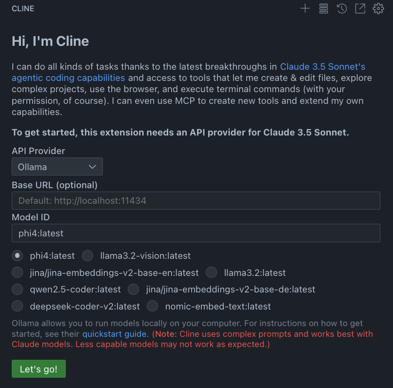

# Cline

https://ollama.com/library/phi4
https://github.com/cline/cline

Preparation

```zsh
# Model
ollama pull phi4

# Backend
mkdir backend && cd backend
uv init && uv add fastapi ollama && mv hello.py main.py
cd ..

# Frontend
npx create-next-app@latest frontend
```

<!--  -->

# Notes

-   Mac gets loud quickly with too much context
-   No autocomplete like Copilot or Continue. Maybe combo Cline & Continue does the trick?
