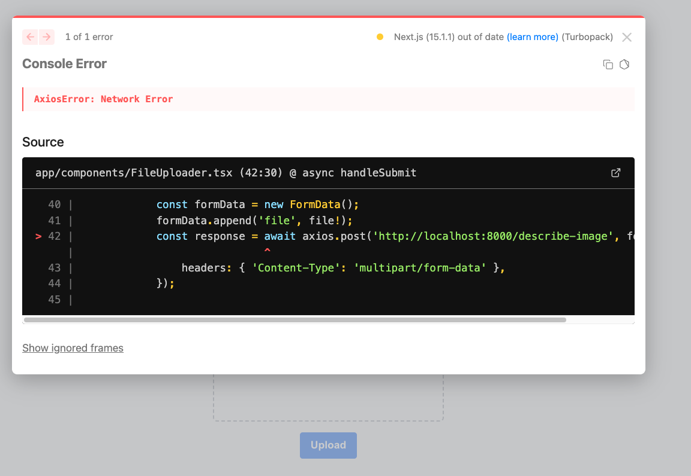

# Continue (offline mode)

<!-- TODO: Retry with official phi4 model (https://ollama.com/library/phi4) -->

We're using Ollama and this `.continue/config.json` settings.

```zsh
ollama pull phi4
```

```json
...
  "models": [
    {
      "model": "vanilj/Phi-4",
      "provider": "ollama",
      "title": "vanilj/Phi-4"
    }
  ],
  "tabAutocompleteModel": {
      "model": "qwen2.5-coder",
      "provider": "ollama",
      "title": "qwen2.5-coder"
  },
  "embeddingsProvider": {
    "provider": "ollama",
    "model": "jina/jina-embeddings-v2-base-en"
  },
  ...
```

**How to automagically edit code?**
Select code you want to edit, push CMD + I. It appears in the sidebar. Then prompt. You can then choose to accept or reject changes.

# Notes

-   Prompts totally didn't work. Ran into errors.
-   Default slash actions not useful to me. Additions/edits didn't show up. Not usable

**Continue** works differently. Have to use the Chat and first create files by myself.

## Additional commands & prompts

### 1. File Upload

```bash
mkdir -p frontend/app/components
touch frontend/app/components/FileUploader.tsx
code frontend/app/components/FileUploader.tsx
```

Then I pushed 'Apply' for the first code snippet. The FileUploader had additional dependencies which the model mentioned further below in the chat. Had to

```bash
cd frontend && npm install react-toastify
```

The model also wrote I should create a page `pages/index.tsx`. But within frontend/app there was already a default `page.tsx`. I just opened it and pushed 'Apply'. Fixed the import path for `FileUploader` and removed an underlined word `newWindow`. Nothing red.

Check if it worked

```bash
npm run dev
open http://localhost:3000
```

Encountered this error with Continue and copy&pasted it into the chat.

```
⨯ ./app/components/FileUploader.tsx:1:17
Ecmascript file had an error
> 1 | import React, { useState } from 'react';
    |                 ^^^^^^^^
  2 | import { toast } from 'react-toastify';
  3 |
  4 | const FileUploader = () => {

You're importing a component that needs `useState`. This React hook only works in a client component. To fix, mark the file (or its parent) with the `"use client"` directive.
```

The model suggested to add "use client" on top of `FileUploader.tsx`. That was the fix. Frontend worked as expected.

### 2. Image to Text

Continue wanted me to work.

```bash
cd backend && mv hello.py main.py
code main.py
```

Then I 'Apply'. Discovered `ModuleNotFoundError: No module named 'ollama'`. Fixed it quickly `uv add ollama`.

Check if it worked

```bash
uv run uvicorn main:app --reload
curl -X POST http://localhost:8000/<PATH_MAY_VARY> -F file=@test_image.png
```

The backend I created with Continue responded with `{"detail":"'description'"}` after I send this `curl -X POST http://localhost:8000/describe-image/ -F file=@test_image.png`.
Changed `return {"description": response["description"]}` to `return {"description": response['message']['content']}`

Then it worked.

### 3. Result Display

Here we got lost completely.

> Can't u handle the changes u suggested within @page.tsx, @FileUploader.tsx and @main.py?

It basically showed me content of the files I mentioned. Only FileUploader.tsx contained changes I 'Apply'd. Had to `npm install axios` ... Why?

> Can't click on the Upload button.

Then several iterations more. Gave up. ❌

## Result

It looks like it works. Yet I couldn't push the Upload button.


And even funnier, the flow was different. I was able to drag an image into the empty space and then I could push the Upload button. However, this ended in an error message.


