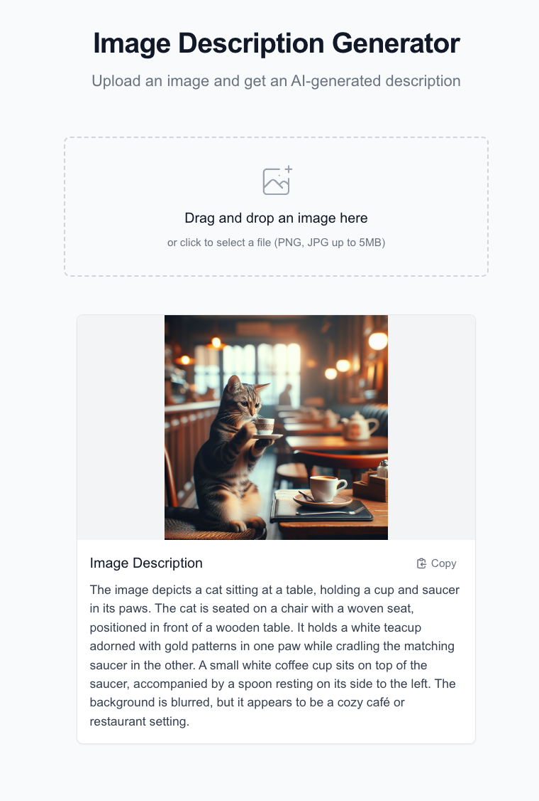

## Start & Stop Web App

Start backend and frontend:
```bash
cd backend && uv run uvicorn main:app --reload
cd frontend && npm run dev
```

Stop all servers:
```bash
pkill -9 -f "uvicorn|next"
```

## Prompts
<!-- TODO: add prompts and additonal commands to /README.md later -->
### 1. File Upload

>I created the nextjs project within `img-to-text-with-windsurf/frontend`. Help me implementing the **File Upload** feature. Note, we'll work on `img-to-text-with-windsurf/backend` after that.

Additional commands
```bash
# Install additional dependencies
npm install react-dropzone --save

# Run server
npm run dev
```
It did all alone. Frontend http://localhost:3000 looks nice.

### 2. Image to Text
Me
```bash
ollama pull llama3.2-vision 
cd backend && uv init && uv add fastapi
```
>We've created a nice looking UI. Now let's move on to **Image to Text**. I initialized the uv project first and installed FastAPI for the backend (`cd backend && uv init && uv add fastapi`). Create the fastapi backend. It should accept an image as input from the frontend, send the image to the ollama model (you have an example for this) and receive the response from ollama. I also provided a test_image.png in `backend/`.

```bash
uv run main.py

curl -X POST http://localhost:8000/api/describe-image -F file=@test_image.png
```

### 3. Result Display
>Frontend seems to work and the backend as well (both are turned off at the moment). Now let's work on **Result Display**.

>It should all work at http://localhost:3000. Also note that npm server and fastapi have to be running so that i can try

```bash
uv run uvicorn main:app --reload
npm run dev
```

>In general it works. But it would also be nice to see the image which was uploaded. Let's add that.

## Conclusion
See yourself



Worked all nicely :)

Shut down uvicorn and npm server via:
```bash
pkill -9 -f "uvicorn|next"
```